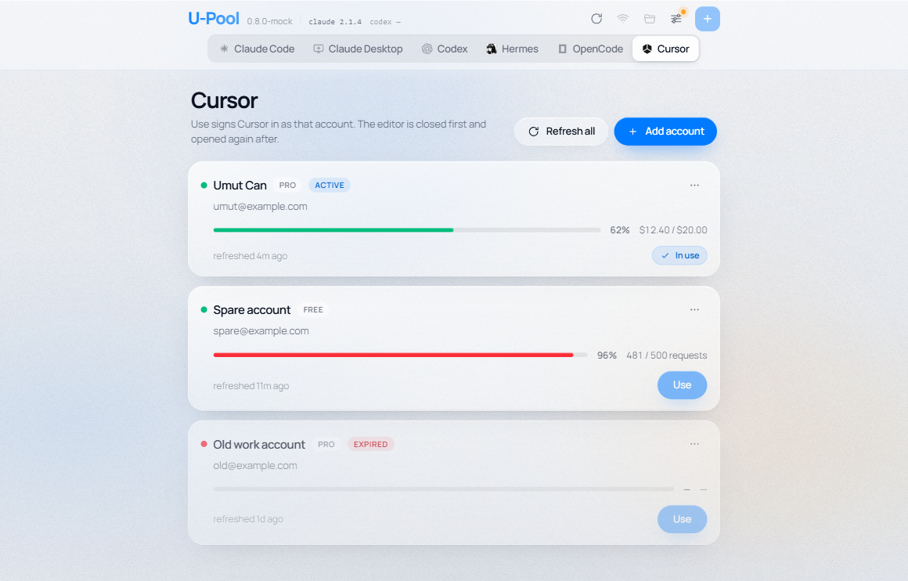

# U-Pool

**One place for every AI-coding endpoint, key and model — switch the active account with a click.**

Claude Code, Claude Desktop, Codex, Hermes, OpenCode and now a pool of Cursor accounts, each in its own tab. For anyone who runs more than one endpoint against these tools and is tired of hand-editing `settings.json`, `config.toml` and the Windows environment to move between them.

Python backend · Next.js UI · native OS webview — no Electron, no Node at runtime.

<p align="center">
  <a href="https://github.com/U-C4N/U-Pool/stargazers"></a>
  <a href="https://github.com/U-C4N/U-Pool/network/members"></a>
  
  <a href="https://github.com/U-C4N/U-Pool/releases/latest"></a>
</p>

<p align="center">
  
</p>

<p align="center">
  <sub>The 0.8.0 Cursor pool — six tabs, one account in use, one browser-cookie row with Use disabled, one expired.</sub>
</p>

**Download:** grab `U-Pool-0.8.0-win64.zip` from the [latest release](https://github.com/U-C4N/U-Pool/releases/latest), unzip it somewhere you own (**not** `Program Files` — Windows will not let the app replace itself there on update) and run `U-Pool.exe`. It updates itself from then on. Building from source is [below](#quick-start).

**Platforms:** the app, every config-file write and the Cursor pool are cross-platform. Three integrations are Windows-only — the `HKCU\Environment` writes, launch at sign-in, and the in-app updater — and say so where they appear.

---

## Contents

- [Why U-Pool?](#why-u-pool) · [Features](#features) · [How it works](#how-it-works)
- [The Cursor pool](#the-cursor-pool) · [Per-app notes](#per-app-notes)
- [Quick start](#quick-start) · [Configuration & internals](#configuration--internals) · [License](#license)

## Why U-Pool?

Switching between Anthropic, OpenRouter, DeepSeek, Azure, xAI, a Cursor account and custom relays usually means editing config files — and, on Windows, environment variables — by hand. U-Pool turns that into a desktop app: one list per tool, one click to make an account live, and a health check that measures latency without spending a token. Every write is surgical (it changes only the keys U-Pool owns) and atomic (temp file + `os.replace`), with a copy left beside every file it touches.

## Features

The four that are the whole point:

- **Surgical writes** — a switch changes only the keys U-Pool owns. Plugins, marketplaces, themes, hooks, MCP servers and per-project trust in `settings.json` / `config.toml` stay exactly where they are.
- **Windows environment** — the CLIs also read their endpoint and key straight out of `HKCU\Environment`, so a switch writes there too and broadcasts the change; only names U-Pool set are ever removed.
- **Cursor pool** — a sixth tab holding Cursor accounts: paste cookies in any common form, see each account's name, email, plan and usage, and switch between the ones you have signed into Cursor. ([details](#the-cursor-pool))
- **Reachability probe** — a plain `GET` at the provider's models endpoint. Latency only, no completions, no token cost.

<details>
<summary>The rest, by theme</summary>

**Safety**

| | |
| --- | --- |
| Atomic writes | Temp file + `os.replace`; a crash mid-write cannot leave a half-written config |
| Backups | One copy beside the original — `settings.json.backup` and friends — refreshed each change, switchable off |
| First-run import | Whatever is already configured for each of the five provider apps becomes a provider, instead of being overwritten |
| Refuses a broken file | A config that will not parse stops the switch rather than being clobbered |

**The apps**

| | |
| --- | --- |
| Claude Desktop | A tab, preview only — providers are saved and can be tested, but nothing is written yet |
| Hermes & OpenCode | Their own config writers — `config.yaml` spliced section by section, `opencode.json` merged key by key |
| CLI versions | The header reports the installed Claude Code and Codex versions, read off the machine and cached |
| Delete all sessions | Two red buttons that erase each CLI's transcripts and prompt history — and nothing else in those folders |

**Windows integration**

| | |
| --- | --- |
| In-app updates | A pulsing Update button when a newer release is out; it downloads, verifies and swaps itself |
| Launch at sign-in | One `HKCU\...\Run` entry, added and removed by a switch |

**Per-provider options**

| | |
| --- | --- |
| Presets | Curated templates per tool — CodeFast, Yunwu, DeepSeek, Kimi, OpenRouter, MiniMax, Z.ai, Azure, xAI, Custom and more (each tool has its own catalogue) |
| Official mode | Hand control back to the vendor login by clearing everything U-Pool manages |
| Permission switches | Per-provider checkboxes: bypass mode, skip-dangerous prompt, auto-accept edits, project MCP trust, Codex approvals/sandbox, live web search |

</details>

## How it works

```
┌───────────────────────────────────────────────┐
│  Next.js (static export)  ── window.pywebview │  UI
├───────────────────────────────────────────────┤
│  Api  →  Store  →  Adapters  →  live files    │  Python
└───────────────────────────────────────────────┘
```

`~/.u-pool/config.json` is the source of truth. On every switch U-Pool hands the chosen record to an adapter, which changes only the keys it owns in each target and leaves the rest of the file as it found it. The files are not the whole story: the CLIs also read variables straight out of the Windows environment, so a switch writes there too.

| App | Target | What a switch writes |
| --- | --- | --- |
| Claude Code | `~/.claude/settings.json` | the owned names in the `env` block: base URL, auth token / API key, models, extras |
| Claude Code | `~/.claude/settings.json` | while a checkbox is ticked: `permissions.defaultMode`, `permissions.skipDangerousModePermissionPrompt`, `enableAllProjectMcpServers` |
| Claude Code | `HKCU\Environment` | the same names again: `ANTHROPIC_BASE_URL`, `ANTHROPIC_AUTH_TOKEN` *or* `ANTHROPIC_API_KEY`, `ANTHROPIC_MODEL`, `ANTHROPIC_SMALL_FAST_MODEL`, extras |
| Claude Desktop | — | nothing yet; the provider is saved and marked current, and you get a notice saying so |
| Codex | `~/.codex/config.toml` | `model_provider`, `model`, one `[model_providers.<slug>]` table, and (per checkbox) `approval_policy`, `sandbox_mode`, `web_search` |
| Codex | `~/.codex/auth.json` | written from scratch: `{"OPENAI_API_KEY": "…"}` when that is the provider's env key, otherwise `{}` |
| Codex | `HKCU\Environment` | the provider's `env_key`, plus `OPENAI_BASE_URL` |
| Hermes | `%LOCALAPPDATA%\hermes\config.yaml` | one entry under `providers:`, plus `model.provider` and `model.default` |
| OpenCode | `~/.config/opencode/opencode.json` | one entry under `provider`, plus `$schema` and the top-level `model` |
| Cursor | `%APPDATA%\Cursor\...\state.vscdb` | eight named `cursorAuth/*` + `glass.lastSignedInAuthId` rows, and nothing else in the database |

Hermes, OpenCode and Cursor read their credentials from their own files, so none of them writes to `HKCU\Environment`.

<details>
<summary>What a switch leaves alone</summary>

Since 0.6.0 the write is surgical: U-Pool reads the file, replaces the handful of keys it owns, and puts the rest back untouched. Two things are still owned **whole**, because that is exactly where a pile-up used to happen — the owned names in the `env` block of `settings.json`, and the active provider's `[model_providers]` table in `config.toml` (the dead tables are dropped and named in the toast). Everything else — `enabledPlugins`, `theme`, `hooks`, `statusLine`, `permissions.allow`/`deny`, `[mcp_servers.*]`, `[projects.*]` trust, your comments — survives. On Codex a key whose value has not changed is not even re-rendered, so its trailing comment stays put.

The full reasoning lives in [`docs/superpowers/specs/2026-07-31-upool-0.6.0-design.md`](docs/superpowers/specs/2026-07-31-upool-0.6.0-design.md). And a file that will not parse stops the switch instead of being overwritten: preserving what U-Pool did not write means reading it first.

</details>

<details>
<summary>Windows environment, and Backups</summary>

Codex resolves its key by name — `config.toml` says `env_key = "codefast"` and Codex then looks for `codefast` in its process environment, which no file U-Pool writes can supply. So a switch also writes `HKCU\Environment` and broadcasts `WM_SETTINGCHANGE`, so a program started afterwards sees the change without a sign-out. U-Pool records the names it sets in `~/.u-pool/env-owned.json` and **deletes only those** — a variable you set by hand is never removed, and switching to the official provider clears the namespace U-Pool claimed and nothing else. **Settings → Windows environment** lists what is managed, masks the values, marks anything set outside U-Pool, and opens the Windows editor. Off Windows the whole feature is inert.

Every file U-Pool is about to change is copied once beside the original as `<filename>.backup` — `settings.json.backup`, `config.toml.backup`, `auth.json.backup`, `state.vscdb.backup`. One current copy, overwritten each time, not a history; registry values go to `~/.u-pool/backups/environment.backup.json` instead. The switch in **Settings → Backups** turns copies off — and with it off nothing is copied at all, including before a Cursor switch, the riskiest write in the app. Putting a backup back is a rename.

</details>

## The Cursor pool

A Cursor account is not a provider — no base URL, no API key, no model, just a session token — so it gets its own tab rather than a provider form. The five existing apps are untouched.

**Add account** is one paste box (or a file picker for `.txt` / `.csv` / `.json`, appended to the box) that takes whatever you have: a Netscape `cookies.txt` line, a whole `Cookie:` header, a bare `WorkosCursorSessionToken=…` (or `__Secure-next-auth.session-token` / `next-auth.session-token`), a raw `user_…::token` encoded or not, an `email,token` CSV row, or JSON at any nesting. Paste one line or two hundred; unrecognised lines are counted and skipped. Accounts are keyed on the user id **inside** the cookie, not the email, so re-pasting a rotated cookie refreshes that account in place. A credential with no `user_…::` half — a bare JWT, or a CSV row whose token is a bare JWT — is skipped even though the email beside it is readable; that is the usual reason a line lands in the skipped count.

Every account refreshes in the background on launch (there is also **Refresh all** and a per-card refresh), against the endpoints cursor.com's own dashboard calls — `/api/auth/me` for name, email and avatar, `/api/auth/stripe` for the plan, `/api/usage-summary` (or the legacy `/api/usage?user=…` for a request-quota plan) for the meter. A figure that was never learned renders as `—`; one that stops arriving keeps its last value rather than blanking, because a Cursor outage must not wipe a working card. A cookie cursor.com rejects marks the row **Expired** and disables its button, but a timeout, a 5xx or a non-JSON body leaves the row alone.

### What a cookie can and cannot do

A cookie exported from a browser reads the account, but it is a `web` token — and **writing one into `state.vscdb` makes the desktop app reject it and sign itself out.** Only the `session` token Cursor writes when you sign into an account *in the app itself* signs the desktop client in. So:

- U-Pool banks that session automatically. The account you are already signed into is adopted into the pool on launch and marked in use, so a first switch can never throw away a session you have no other copy of. (It is added only if that user id is not already pooled, so it never overwrites a token you pasted; deleting the row just re-adopts it next launch, and the account currently in use cannot be deleted at all.)
- The accounts you can switch to are the ones you have signed into Cursor at least once, or whose `session` token you paste directly.
- A browser-cookie row shows its usage but **Use is disabled**, with a note saying why, rather than signing you out. Turning a browser cookie into a session token — Cursor's own deep-login exchange — is [proven possible](docs/superpowers/specs/2026-08-05-upool-0.8.0-design.md) and planned, but not in 0.8.0.

### What a switch touches

**Use** closes Cursor (only if it is running), copies `state.vscdb` beside itself, writes eight keys, and starts Cursor again (only if U-Pool was the one that closed it — otherwise the toast asks you to). If Cursor does not close within ten seconds, **nothing is written — not even the backup** — and the switch tells you to close it yourself; the failure mode of a half-applied auth record is an editor that can neither sign in nor sign out. There is no force kill.

What a switch owns is **eight keys named in full** — seven `cursorAuth/*` rows plus `glass.lastSignedInAuthId` — never the `cursorAuth/` prefix, because a prefix sweep would take whatever Cursor adds under it next. `cursorAuth/onboardingDate` is written by a sign-in but deliberately **not** owned: U-Pool cannot produce one, and blanking it would ask Cursor to run onboarding again. `cursorDiskKV` and `composerHeaders` — your Cursor conversations — are never opened, and neither are the `mcpOAuth.secret.*` rows in the same table. The telemetry machine ids in `storage.json` and `%APPDATA%\Cursor\machineId` are **not** touched: resetting those is not part of switching accounts, and the key list itself came from one measured sign-in on Cursor 3.14.7, recorded in the [0.8.0 design](docs/superpowers/specs/2026-08-05-upool-0.8.0-design.md).

On macOS the database is under `~/Library/Application Support/Cursor`, on Linux under `~/.config/Cursor`; only the Windows path has been exercised. Session tokens live in `~/.u-pool/cursor.json` in plain text — the same exposure `config.json` already carries — and the token never leaves the backend: the UI is told only whether one is present.

> **Not verified:** no switch between two *different* accounts has been applied to a live install. A round-trip against the real database reproduced Cursor's own sign-in state byte for byte on all eight keys, but that cannot prove Cursor honours a different account's keys on next start. If a switch goes wrong, the backup is a rename away.

## Per-app notes

<details>
<summary>Claude Desktop — preview only</summary>

A tab that **writes nothing**: providers are saved and can be made current, and a notice above the list says the configuration was not written. Test *does* work — it borrows Claude Code's probe — so "writes nothing" is not "does nothing". The reason it is preview: Claude Desktop has no base-URL setting, so the only lever is the OS environment, and that is the same `ANTHROPIC_*` namespace Claude Code already owns — writing it here would move Claude Code's endpoint too. `%APPDATA%\Claude\claude_desktop_config.json` is never opened.

</details>

<details>
<summary>Hermes</summary>

One `config.yaml` — under `%LOCALAPPDATA%\hermes` on Windows, `~/.hermes` elsewhere, or wherever `HERMES_HOME` points. A provider is an entry in the `providers:` map with `name`, `api`, `api_key`, `transport`, and `default_model` + `models` **only when the record has a model id** (a Hermes provider can be saved without one, unlike OpenCode). `transport` is the field worth getting right — Hermes does not infer it from the URL: `anthropic_messages`, `chat_completions`, `codex_responses` or `bedrock_converse`. A provider's `extra` keys become top-level keys of its entry.

A switch removes only the entry U-Pool wrote before; providers you added yourself stay, and so does every section of the file **outside `model:` and `providers:`** — byte for byte. The `model:` and `providers:` blocks themselves are re-serialised, so comments and exotic YAML *inside those two sections* do not survive a Hermes switch. Per-model context lengths the CLI filled in are carried over for a model still named in the record.

</details>

<details>
<summary>OpenCode</summary>

`~/.config/opencode/opencode.json` on every platform including Windows, under `$XDG_CONFIG_HOME/opencode` when that is set, or wherever `OPENCODE_CONFIG` points. A provider is an entry under `provider` with `npm`, `name`, `options.baseURL`, `options.apiKey` and `models`; the top-level `model` selects it as `"<provider>/<model>"`, which is why the model id is required here. `npm` picks the AI SDK adapter — `@ai-sdk/anthropic`, `@ai-sdk/openai`, `@ai-sdk/openai-compatible`, `@ai-sdk/amazon-bedrock` or `@ai-sdk/google`. `options` is merged, so headers and SDK flags you add through **Extra SDK options** — and per-model metadata the CLI filled in — survive a key rotation.

</details>

<details>
<summary>CLI versions & Delete all sessions</summary>

The header shows the installed **Claude Code** and **Codex** versions (Hermes and OpenCode have tabs but no readout). `shutil.which` is tried first, then the places a global install actually lands — `%APPDATA%\npm`, `%LOCALAPPDATA%\npm`, `%ProgramFiles%\nodejs` and more, each tried as `.cmd`/`.exe`/`.bat`/bare — because a window launched from Explorer inherits the PATH as it stood at logon. A probe also repairs Node on the child's PATH, so an `npm`-but-no-`nodejs` PATH does not read as a broken install. The readout is a cache; **refresh** re-probes, `codex —` means absent, `codex ?` found-but-mute, `codex …` still probing.

**Settings → Sessions** has one red button for **Claude Code** and one for **Codex** — only those two, because the delete list is a fixed table and a button that guessed at a path is the one guess this feature must not make. Confirming erases each tool's transcripts and prompt history from that fixed list and nothing else in the folder; nothing is backed up first — a second copy of a few hundred MB you did not ask for is not a safety net — and the confirm modal names every path.

</details>

## Quick start

**Just want the app?** [Download the latest release](https://github.com/U-C4N/U-Pool/releases/latest) — no toolchain needed.

**From source** (Python 3.11+, Node 20+):

```bash
pip install -e ".[dev]"
cd ui && npm install && npm run build && cd ..
python -m upool           # --version prints and exits; --debug opens DevTools
```

<details>
<summary>UI hot reload, tests, and the sandbox</summary>

```bash
# terminal 1
cd ui && npm run dev
# terminal 2 (bash)
UPOOL_DEV_URL=http://localhost:3000 python -m upool
```

On PowerShell set it first: `$env:UPOOL_DEV_URL="http://localhost:3000"`. Open `http://localhost:3000` in a plain browser for the in-memory mock, no Python bridge.

```bash
python -m pytest          # no --basetemp needed
cd ui && npm run build    # or: npm run typecheck / npm run lint
```

The suite redirects `UPOOL_FAKE_HOME`, `UPOOL_HOME` and three registry keys into a temp dir and a scratch key, and stubs the Cursor process module, so it never touches your real `~/.claude`, `~/.codex`, environment, startup entry or running Cursor. **Outside pytest that protection is off:** `paths.home()` falls back to your real home, so any hand-run probe that reaches a write path reconfigures the machine. `python scripts/sandbox.py <script>` is the only sanctioned way to run one by hand — it redirects the same targets and refuses to run if any escaped.

</details>

## Configuration & internals

**Environment variables U-Pool reads**

| Variable | Purpose |
| --- | --- |
| `UPOOL_DEV_URL` | Load the UI from a dev server instead of the bundled export |
| `UPOOL_DEBUG=1` | Open the webview DevTools (`--debug` is the flag form) |
| `UPOOL_HOME` | Move U-Pool's own state directory |
| `UPOOL_FAKE_HOME` | Redirect **all five** config targets — Claude, Codex, Hermes, OpenCode and Cursor — into a fake home; mandatory under pytest |
| `HERMES_HOME` | Where Hermes keeps `config.yaml` |
| `OPENCODE_CONFIG` / `XDG_CONFIG_HOME` | Move `opencode.json` (the file, or its directory) |

Setting `UPOOL_FAKE_HOME` also overrides `HERMES_HOME`, `OPENCODE_CONFIG`, `XDG_CONFIG_HOME` and the Cursor path, so a test or a sandbox run cannot leak onto a real install.

<details>
<summary>Updates &amp; launch at sign-in (Windows)</summary>

**Settings → Updates** asks GitHub for the latest release at most once every six hours and remembers the answer. When something newer exists the Update button pulses; pressing it downloads the release zip (a partial download resumes, a finished one in `~/.u-pool/update/cache` is reused), checks it against the length and GitHub's own SHA-256 digest, screens every zip member for path traversal, unpacks it beside the install folder and hands over to a small detached script that swaps the folders and restarts. If the swap cannot finish it rolls back to the version you had, and the next launch reports it. **Skip this version** stops a release being offered until the next one. Four situations are refused with a reason and an **Open release page** button instead: not Windows, running from a source checkout, an install that is not the packaged bundle, and any folder U-Pool cannot write (which includes `Program Files`).

**Settings → Startup** writes one `REG_SZ` under `HKCU\...\Run` — no admin rights, no scheduled task. It re-points an entry that still exists at the current build on launch, but never recreates one you deleted, and honours a Task-Manager veto rather than overriding it. From a source checkout the entry is `pythonw.exe -m upool`, which needs U-Pool pip-installed.

</details>

<details>
<summary>Windows bundle (for maintainers)</summary>

```bash
python scripts/build.py            # → dist/U-Pool/U-Pool.exe, dist/U-Pool-<ver>-win64.zip, dist/SHA256SUMS.txt
python scripts/build.py --skip-ui  # reuse an existing ui/out
python scripts/build.py --clean    # remove build/ and dist/ first
```

Onedir (not onefile) for faster startup. The build runs `npm install` itself if needed, smoke-tests the packaged exe with `--version`, and fails if it does not start. Attach `U-Pool-<ver>-win64.zip` and `SHA256SUMS.txt` to a **published** GitHub release tagged `vX.Y.Z`; the in-app updater downloads the zip (the checksum it verifies is GitHub's own asset digest — `SHA256SUMS.txt` is a courtesy for humans), and the zip name must match `^U-Pool-.*win.*\.zip$`.

</details>

**Tech stack** — Python 3.11+ with pywebview, tomlkit and PyYAML · Next.js 16 (static export), React 19, Tailwind 4, TypeScript · setuptools, pytest, PyInstaller to ship. No runtime dependency beyond those three; the network paths are stdlib `urllib`, the Cursor database is stdlib `sqlite3`.

**Design notes** — every release is designed before it is built; the specs live in [`docs/superpowers/specs/`](docs/superpowers/specs/). Release history is in the git tags.

## License

No license is declared yet, which under GitHub's terms means default copyright — please open an issue before reusing the code while that is true. A license will be added.

## Star History

[](https://star-history.com/#U-C4N/U-Pool&Date)

---

<p align="center">
  Made with care by
  <a href="https://x.com/UEdizaslan"><strong>@UEdizaslan</strong></a>
</p>
